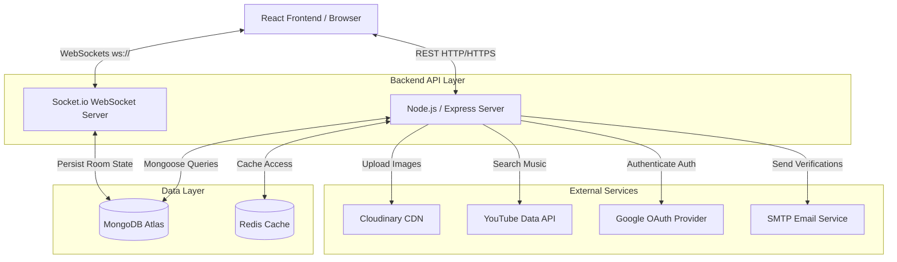
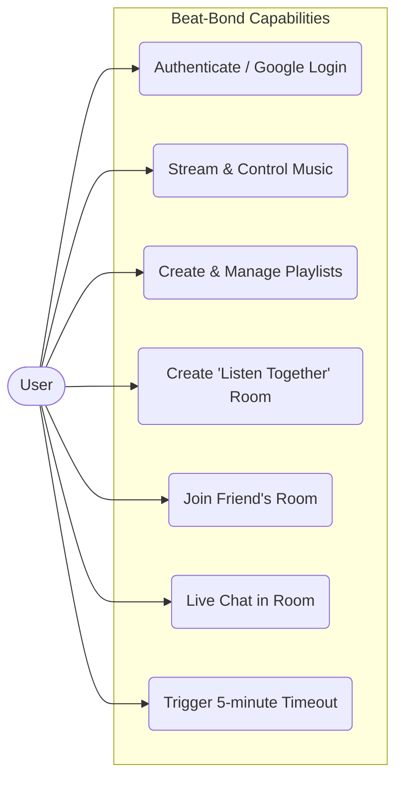
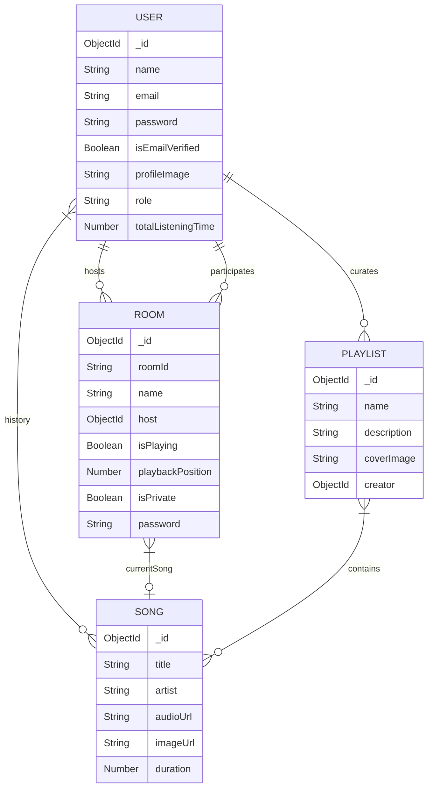

# 🎵 Beat-Bond

> A modern, full-stack music streaming platform built with the MERN stack. Beat-Bond allows users to listen to their favorite tracks, create playlists, and join real-time synchronized "Listen Together" rooms with friends.

---

## 📸 Screenshots & Output
<!-- 
  TODO: Add your project images below! You can drag and drop images directly into GitHub to generate links.
-->

### 🏠 Dashboard Room


### 🎧 Listen Together Room


*(Replace the placeholder image links above with your actual screenshot URLs!)*

---

## ✨ Features
- **User Authentication**: Secure Login and Registration (JWT based), plus Google OAuth 2.0.
- **Music Streaming**: Seamless playback with play, pause, next, back, and volume controls.
- **Listen Together Rooms**: Real-time synchronized playback using Socket.io. Join a room with friends via a unique code, listen to the exact same part of a song instantly, and chat!
- **Playlists & Search**: Search for popular songs via YouTube API and curate custom playlists.
- **Time-Restricted Sessions**: Custom logic restricting free users to 5-minute sessions to demonstrate premium tier architectures.
- **Cloudinary Integration**: Fully integrated dynamic image uploads for user profiles.
- **Responsive Design**: Rich, glass-morphism dark-mode UI built with TailwindCSS and Framer Motion.

---

## 🏗️ System Architecture & Engineering

The application is structured around a scalable full-stack MERN architecture. Here are the core architecture pillars:

1. **Frontend Presentation Layer**: Built with React (Vite fast-bundler) as a Single Page Application (SPA), utilizing Redux Toolkit for complex centralized audio/user state management and Tailwind CSS for rapid responsive styling.
2. **API & Business Logic Layer**: A robust Node.js/Express.js backend providing RESTful endpoints, applying middleware for JWT authentication, error handling, and file upload parsing.
3. **Real-time Communication Layer**: Standalone Socket.io namespaces and event emitters managing synchronized music state, playback timeline tracking, and live chat features for multi-user Rooms. 
4. **Data Persistence Layer**: MongoDB serving as the primary unstructured NoSQL database, structured through Mongoose ODM schemas allowing dynamic references between Users, Rooms, and Songs.
5. **Caching & Session Layer**: Redis infrastructure implemented to cache intense queries, store temporary authentication states, and rapidly serve shared room states.
6. **External Integrations & Microservices**: Integrates heavily with third-party APIs: **Cloudinary** for scalable image hosting/delivery, **YouTube API** for vast music searching/scraping, **Google OAuth 2.0** for Single Sign-On, and an SMTP target for Mail delivery.

### ASCII System Architecture (Terminal-based)
```text
======================================================================
                         [ Client (Browser) ]
                          React / Redux SPA
======================================================================
               |                                  |
               | HTTP/REST Requests               | WebSockets (ws://)
               v                                  v
======================================================================
                       BACKEND API LAYER
  +-----------------------+              +-------------------------+
  |    Express Server     |              |     Socket.io Server    |
  |  (Auth, Users, Songs) |              |  (Rooms, Chat, Sync)    |
  +-----------------------+              +-------------------------+
======================================================================
   |             |           |                        |
   | Database    | Cache     | External APIs          | Sync State
   v             v           v                        v
+---------+  +-------+  +-----------------------+  +---------+
| MongoDB |  | Redis |  | - Cloudinary (Images) |  | MongoDB |
| (Atlas) |  |       |  | - YouTube API (Music) |  |         |
+---------+  +-------+  | - Google OAuth (Auth) |  +---------+
                        | - SMTP (Emails)       |
                        +-----------------------+
```

### System Architecture Diagram (Mermaid)


### Use Case Diagram


### Database Entity-Relationship Diagram (ERD / Class)


---

## 🚀 Run Locally

To run this project on your local machine, follow these steps:

### 1. Clone the repository
```bash
git clone https://github.com/arjun-holland/Beat-Bond.git
cd Beat-Bond
```

### 2. Setup Environment Variables
Create a `.env` file in the **`backend`** directory. You must configure **all of the following variables** for the platform to function fully:

| Variable | Description | Example / Source |
| :--- | :--- | :--- |
| `PORT` | API Port | `5000` |
| `NODE_ENV` | Environment logic | `development` or `production` |
| `MONGO_URI` | MongoDB Connection String | `mongodb+srv://...` |
| `REDIS_URI` | Redis Connection String | `redis://...` |
| `JWT_SECRET` | Primary JWT encryption key | `your_super_secret_key` |
| `JWT_REFRESH_SECRET` | Long-lived JWT key | `your_refresh_secret` |
| `CLIENT_URL` | Frontend URL | `http://localhost:5173` |
| `GOOGLE_CLIENT_ID` | OAuth Client ID | `Google Cloud Console` |
| `GOOGLE_CLIENT_SECRET` | OAuth Client Secret | `Google Cloud Console` |
| `EMAIL_USER` | SMTP App Email Address | `your_email@gmail.com` |
| `EMAIL_PASS` | SMTP App Password | `16-digit app password` |
| `EMAIL_FROM` | Base Sender Address | `no-reply@beatbond.com` |
| `YOUTUBE_API_KEY` | Music Search API Key | `Google Cloud Platform` |
| `CLOUDINARY_CLOUD_NAME` | Cloudinary Storage Name | `Cloudinary Console` |
| `CLOUDINARY_API_KEY` | Cloudinary API Key | `Cloudinary Console` |
| `CLOUDINARY_API_SECRET` | Cloudinary API Secret | `Cloudinary Console` |

### 3. Install Backend Dependencies & Start Server
```bash
cd backend
npm install
npm run dev
```

### 4. Install Frontend Dependencies & Start Client
Open a new terminal and navigate to the frontend:
```bash
cd frontend
npm install
npm run dev
```

The app will now be available at `http://localhost:5173`.

---

## 🌐 Deployment
This application is fully containerized and production-ready.
- **Backend API**: Hosted on [Render](https://render.com)
- **Frontend App**: Deployed as a Vite Static Site on Render using HashRouter for seamless SPA routing.

---

## 👨‍💻 Contributing
Pull requests are welcome. For major changes, please open an issue first to discuss what you would like to change.

## 📄 License
[MIT](https://choosealicense.com/licenses/mit/)
